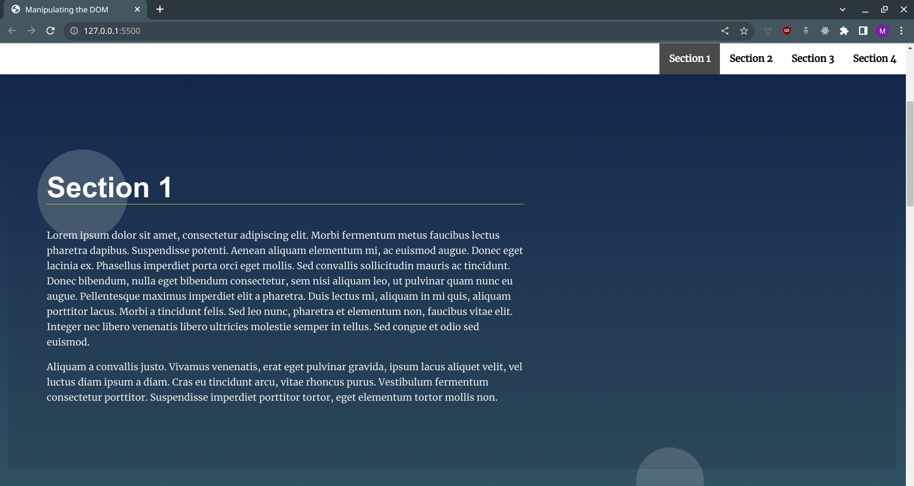

# Landing Project

## Table of Contents
- [Description](#description)
- [showcase](#showcase)
- [Acknowledgements](#acknowledgements)
- [License](#license)

## Description
[(back to the top)](#landing-project)

This is the multi-section landing project for Udacity's Egypt-FWD Professional Frontend track. The goal of this project is to showcase the skills and knowledge acquired throughout the program by building an interactive landing page by utilizing JavaScript to facilitate webpage manipulation using DOM.

## Showcase
[(back to the top)](#landing-project)

The webpage builds the the section navbar dynamically based on the sections.

## Acknowledgements
[(back to the top)](#landing-project)

- Thanks to [Udacity](https://www.udacity.com/) for providing the original starter package.

## License
[(back to the top)](#landing-project)

- [GNU General Public License version 3](https://opensource.org/licenses/GPL-3.0)
- [Udacity License](./LICENSE.txt)