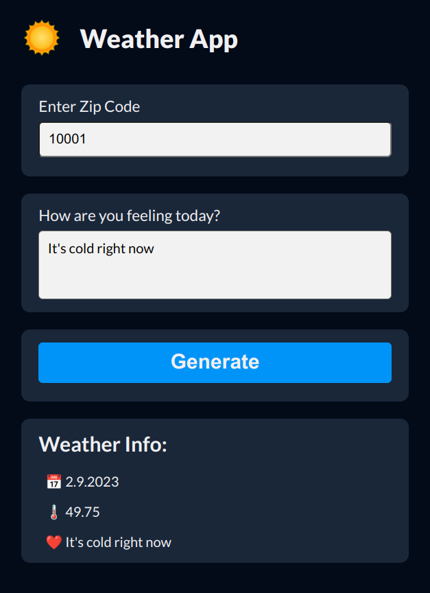

# US Weather App
## Table of contents
- [Description](#description)
- [How to run](#how-to-run)
- [Showcase](#showcase)

## Description
[(return to top)](#us-weather-app)

This is Weather Journal App project for Udacity's [Egypt-FWD](https://egfwd.com/) Professional Frontend track built using `Node JS` and `Express Framework`. 

Users can use it to get weather info in your are using zip code, also they can send a message about their current feelings to the local server.

The goal of this project is to showcase the HTML/CSS/JS skills and knowledge acquired throughout the program by creating an asynchronous web app that uses Web API and user data to dynamically update the UI. 

## How to run
[(return to top)](#us-weather-app)

You should have [Node JS](https://nodejs.org/en/download/) and [VS Code](https://code.visualstudio.com/download) installed in your system.

- Open the folder project inside VS Code and run the following command to install the necessary packages: `npm install`
- Run `npm run start` to start the server
- open `localhost:8000` in the browser 

## Showcase
[(return to top)](#us-weather-app)

